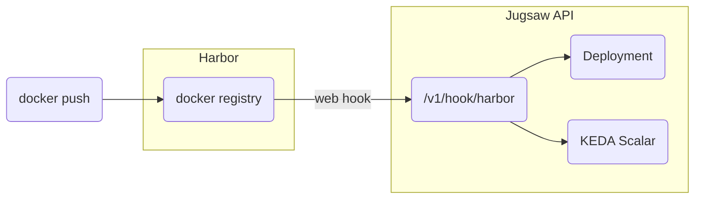
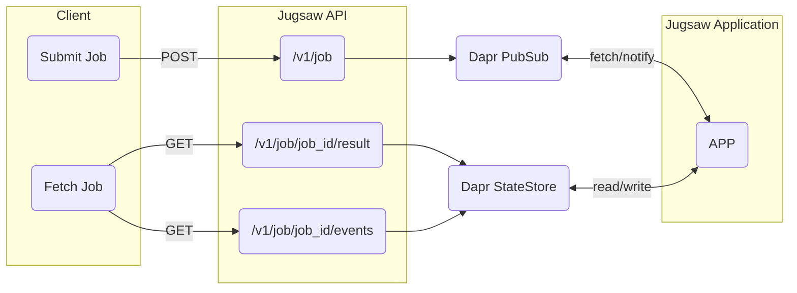

# Jugsaw Web API

## Deployment

```mermaid
flowchart LR
  A(docker push)
  subgraph Harbor
    B(docker registry)
  end
  subgraph Jugsaw API
    C(/v1/hook/harbor)
    D(Deployment)
    E(KEDA Scalar)
    C --> D
    C --> E
  end
  A --> B-->|web hook|C
```

## Job Handling

```mermaid
flowchart LR
  subgraph Client
    A(Submit Job)
    F(Fetch Job)
  end
  subgraph Jugsaw API
    direction LR
    B(/v1/job)
    BB(/v1/job/job_id/result)
    BBB(/v1/job/job_id/events)
  end
  subgraph Jugsaw Application
    P(APP)
  end

  C(Dapr PubSub)
  D(Dapr StateStore)
  A -->|POST|B --> C
  F -->|GET|BB --> D
  F -->|GET|BBB --> D
  C<-->|fetch/notify|P
  D<-->|read/write|P
```
